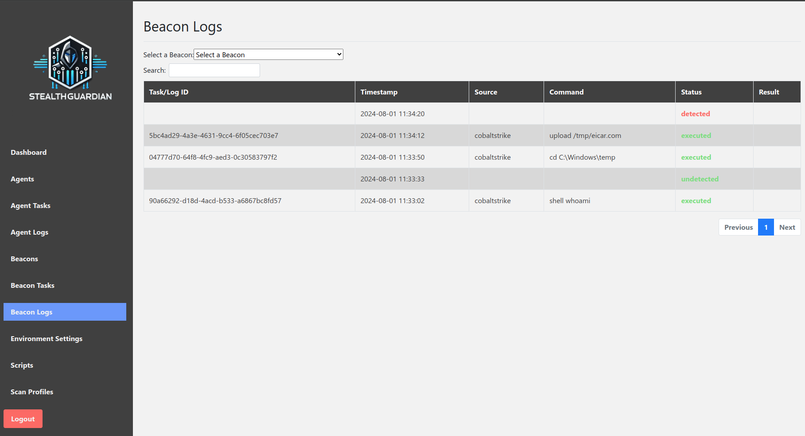

# StealthGuardian

Performing adversary simulation exercises is a time-consuming task, especially when developing new attack mechanisms and testing those against defence systems that have been deployed to the target. 

With this tool we have streamlined the process of testing developed tools and attack patterns by forwarding those into a reference system and observing logfiles and alarm messages of defence tools. Based upon the results the tool decides if it would be safe to execute the action or let the Red Team know that the action has been detected.

The tool is easy to be integrated into existing adversary simulation tools and also easy to be extended with new defence systems.



## Installation
The tool is recommended to be installed on a `Linux` system, it has been tested on the latest release of `Ubuntu`.

### Middleware
Configure your environment by adjusting settings in `.env`, this file also allows you to disable SSL verification if you run StealthGuardian with a custom certificate.

Please execute the `start.sh` script within this directory, it will automatically configure and verify your StealthGuardian environment - Alternatively, you can run `docker-compose up` which will however not do any pre-checks against your environment:

```
ysec@stealthguardian:~/GIT/stealthguardian$ bash start.sh 
Check passed: docker-compose is installed.
Check passed: .env file exists.
Check passed: Default API key is not used.
Check passed: docker-compose.yml file exists.
Check passed: SSL certificate files exist.
Services defined in the docker-compose.yml file:
Service: stealthguardian-middleware
  Image: stealthguardian-middleware:latest
  Replicas: 1
Service: stealthguardian-cs-integration
  Image: stealthguardian-cs-integration:latest
  Replicas: 1
Check passed: CobaltStrike_Directory '/home/ysec/GIT/cobaltstrike' exists.
CobaltStrike is enabled.
All checks passed.
Press Enter to continue and start docker-compose up...
[+] Running 2/0
 ⠿ Container stealthguardian-stealthguardian-middleware-1      Recreated                                                                                                                                                       0.0s
 ⠿ Container stealthguardian-stealthguardian-cs-integration-1  Recreated                                                                                                                                                       0.1s
Attaching to stealthguardian-stealthguardian-cs-integration-1, stealthguardian-stealthguardian-middleware-1
...
```

### Cobalt Strike integration
If you want to use `StealthGuardian` with Cobalt Strike, please import [./integration/cobaltstrike/stealthguardian.cna](./integration/cobaltstrike/stealthguardian.cna) to your Cobalt Strike client. A new menu will show at the top which can be used to configure the connection to the `Middleware`. Further information on commands for this integration can be found in [./integration/cobaltstrike/Readme.md](./integration/cobaltstrike/Readme.md)

If you have an active `Beacon` in CobaltStrike, it is now available under the `Beacons` page of `StealthGuardian`.

Afterwards, open your `Middleware` and browse to `Environment Settings`. On this page ensure that the `cs_teamserver_ip`, `cs_teamserver_port` and `cs_teamserver_password` key is defined. The value shall be the IP/Hostname and Port by which the `Integration` component can reach the `Teamserver`.

### Windows Defender Agent
In order to register an `Agent`, please follow the below steps:

1. Open your `Middleware` and browse to `Environment Settings`. On this page ensure that the `endpoint` and `port` key is defined. The value shall be the IP/Hostname and Port by which the `Agent` can reach the `Middleware`.
2. Download `1_register.ps1 `, `2_beacon_control.ps1`, `3_transmit_log.ps1`, `4_install_task.ps1` to your endpoint, files are available via `/agent/<filename>` and automatically have SSLVerification disabled if needed
3. Register your endpoint with `.\1_register.ps1 <IP of stealthguardian> 45134`
4. Use `.\4_install_task.ps1` to automatically check for new commands and sending logs
5. In StealthGuardin go to `Agents` and assign your `Reference Beacon` to the `Agent`
6. In Cobalt Strike you can now run `stealthguardian <bid of reference beacon> shell whoami` (run `printBeacon` to get your current BeaconID or `listBeacons` to list all available Beacons.)

## Usage
A usage guide with screenshots can be found in [How To Use StealthGuardian](./documentation/Usage.md).


## StealthGuardian Components

The implementation of `StealthGuardian` consists of three parts that are described in the below in more detail:

* Integration: The `Integration` component is the bridge between the adversary simulation tool and the middleware. It forwards executed actions to the `Middleware`.
* Middleware: The `Middleware` takes actions from the `Integration` and forwards those to a reference system/implant where they will be executed. The middleware then communicates with the `Endpoint Agent` to verify if the executed action has been detected.
* Endpoint Agent: The `Endpoint Agent` observes defined logfiles and alerts during the execution of actions to verify if a malicious event has been detected.


### Integration

The `Integration` component is the bridge between the adversary simulation tool and the middleware. It forwards executed actions to the `Middleware`.

In Fortra's Cobalt Strike threat emulation tool this has been implemented as a `Agressor Script`. Prior to a command/action being executed, the Red Teamer can decide if the action should be executed against a reference software beacon that mimics the actual target.


### Middleware

The `Middleware` is a HTTP service that waits for actions to be executed against a reference system/implant. It utilizes a queuing system and various configuration options such as creating a new reference system after an action has been executed or re-using a system to test multiple actions in a row.

After execution of the actions, the `Middleware` communicates with the `Endpoint Agent` to verify if the executed actions have been detected. In both cases, the `Middleware` communicates back to the `Integration` to display its results. If no malicious behaviour has been detected, the `Middleware` can automatically execute the action against the target.


### Endpoint Agent

 The `Endpoint Agent` observes user-defined logfiles and alerts during the execution of actions to verify if a malicious event has been detected. After execution of the action by the `Middleware`, the `Endpoint Agent` communicates its results back.


## Documentation
The webservice documentation can be found at [https://yourip:45134/docs#/](https://yourip:45134/docs) and [https://yourip:45134/redoc](https://yourip:45134/redoc). Additionally, the OpenAPI specification can be found in [openapi.json](./documentation/openapi.json).

A full guide on writing your own `Integration` or `Agent` component can be found in [HowToExtend.md](./documentation/HowToExtend.md)

# Frequently Asked Questions
The below may help you to get the most out of `StealthGuardian`. If you don't find the information you need here, please feel free to contact us or raise an issue:

**How Do I Install StealthGuardian?**

>We have written a full guide on how `StealthGuardian` can be installed as a Docker environment. Please have a look at the [Installation](#installation) documentation.

**Can I use StealthGuardian with Adversary Toolkit XY?**

>`StealthGuardian` can easily be integrated with Adversary Toolkits as long as they provide a way to extend it. A full description on how to integrate StealthGuardian can be found in [HowToExtend.md](./documentation/HowToExtend.md).

**The Attacked System / Detection System Does Not Write Logs to the Host**

> This is no problem - you can also run your `Agent` on a system which is different to the one of your `Beacon`. You would still register an `Agent` per `Beacon` and then do a mapping between the Central Detection System and your `Beacon`. A good example for this would be [Elastic Endpoint Detection and Response](https://www.elastic.co/endpoint-detection-response).

**What Should I Do When An Action Is Reported As Detected?**

> This is up to you and the detected type of event. In some cases `EDR` systems may work differently or even stricter if a malicious event was recognized on the system. In most cases it is recommended to create snapshots of your system, e.g. after installing the `Beacon` and `Agent` to easily revert back to a secure state.

**Why Are Logs Not Automatically Checked after a Command was Issued**

> Most Adversary Toolkits operate asynchronously, meaning we do not always know when a command has been fully executed. Therefore, we continuously gather information from the reference system and provide the option to manually request a check for detected events.


# License
Released under [GNU GENERAL PUBLIC LICENSE Version 3, 29 June 2007](https://github.com/y-security/stealthguardian?tab=GPL-3.0-1-ov-file#readme)


# Changelog
| Date       | Version | Information                                       |
| ---------- | ------- | ------------------------------------------------- |
| 07.08.2024 | 1.0     | First release to the public at Black Hat USA 2024 |
