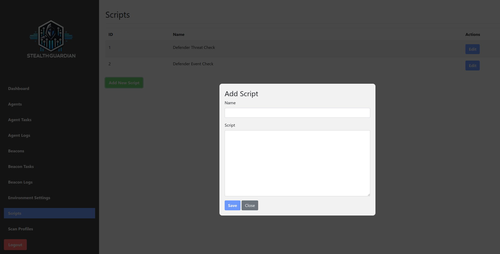
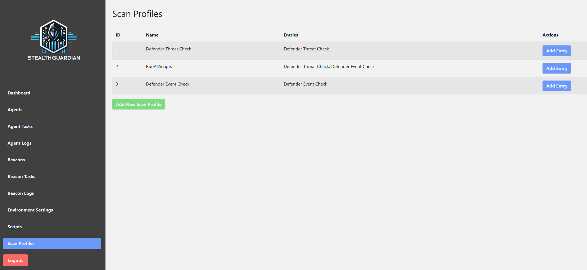
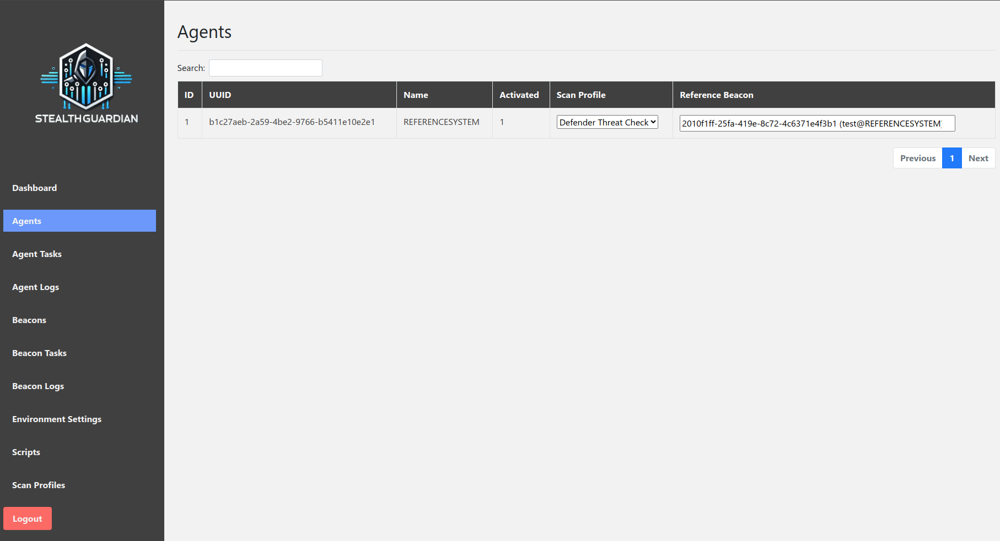
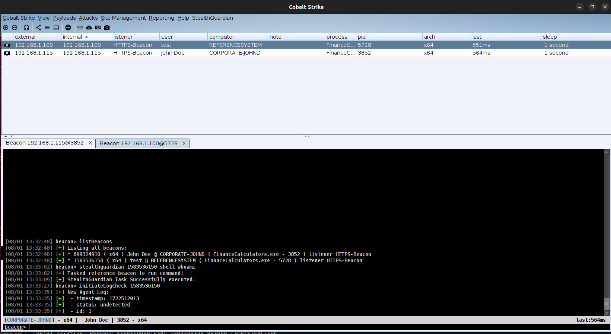
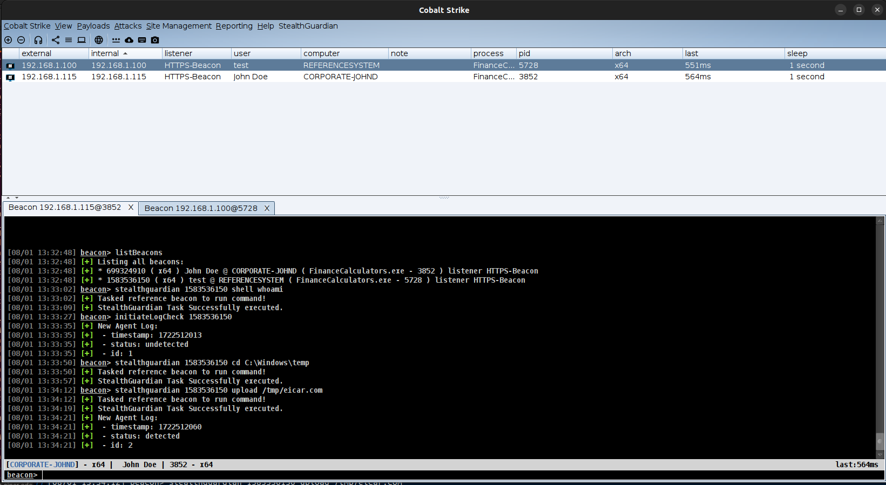
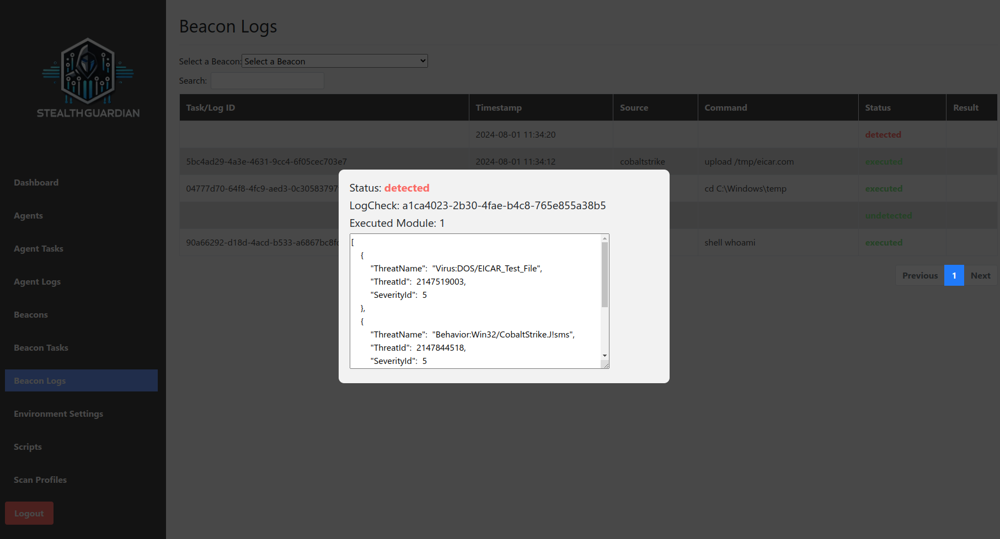

# StealthGuardian Usage

Congratulations - You have successfully followed the installation steps to deploy the StealthGuardian components to your systems. In the below we will step through the general usage of StealthGuardian.

## Add Detection Scripts

StealthGuardian provides an interface to manage detection scripts, including creation of new and editing existing ones. This functionality can be found via the `Scripts` menu item. The programming language of the script does not matter as it will be upon the `Agent` to interpret the given script correctly.



## Combine your Scripts into a Profile

Configured `Scripts` can also be grouped into one profile, making it simpler to manage and deploy multiple scripts to a system. This functionality can be found via the `Scan Profiles` menu item. 



## Assign a Profile

The created `Scan Profile` can then be assigned to an `Agent`, which automatically receives an `Update Configuration` Task from the `Middleware` to download the latest detection scripts. This functionality can be found via the `Agents` menu item. If you haven't done yet, you should also assign a `Reference Beacon` to your agent. This can be done by clicking into the `Reference Beacon` column and selecting an existing `Beacon`.



## Sending Commands

We are now ready to proceed and send commands from Cobalt Strike to our reference system. Within Cobalt Strike we interact with our target `Beacon` and run the `listBeacons` command to receive a list of `Beacons` currently available in our Teamserver, this may look like this:

```
beacon> listBeacons
[+] Listing all beacons:
[+] * 699324910 ( x64 ) John Doe @ CORPORATE-JOHND ( FinanceCalculators.exe - 3852 ) listener HTTPS-Beacon
[+] * 1583536150 ( x64 ) test @ REFERENCESYSTEM ( FinanceCalculators.exe - 5728 ) listener HTTPS-Beacon
```

We see that our `Source Beacon` (the one which we are attacking) has a `buid` of `699324910` and our `Target Beacon` (reference system) has a `buid` of `1583536150`. We will now use the `buid` of the `Target Beacon` in the `stealthguardian` command to execute the command against the reference system to verify if it may be detected:

We will use a simple `stealthguardian 1583536150 shell whoami` command. Within the console we will automatically receive further information about the interaction with the `Middleware`.



Afterwards we will perform an action that should trigger any defence system, such as uploading the `EICAR` test file to the system. This can be done by executing `stealthguardian 1583536150 upload /tmp/eicar.txt`. Within the console we will receive the `Microsoft Windows Defender` notification about the event:



## Correlating Commands and Detections

While we continously gain information about detection events in Cobalt Strike, we can also use `StealthGuardian` to correlate events. This helps to more easily identify when an action or behaviour was detected. This functionality can be found via the `Beacon Logs` menu item.

Within this menu you can select an existing `Beacon` - in our case it will be the `Reference System` with the buid of `1583536150`. StealthGuardian then automatically correlates `Agent Logs` and `Beacon Tasks` into a single view:


Within `StealthGuardian` we have also the option to directly look into the detected threat and learn more about how the defence system detected the event by clicking on a row - in our case we can see that the `EICAR` file was detected as malicious event:


